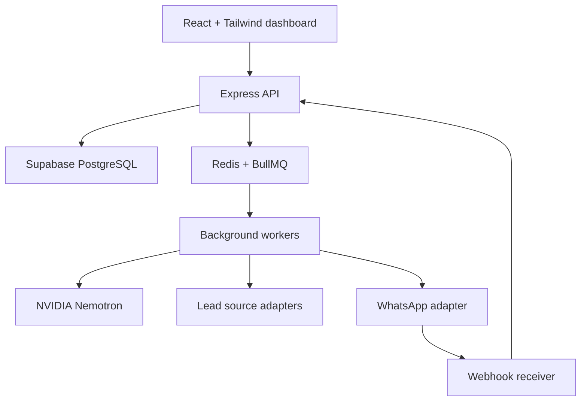

# Digitora AI Lead Automation System

## Complete System Design and Five-Week Implementation Plan

**Owner:** Digitora Solutions  
**Document status:** Build-ready v1  
**Primary goal:** Discover suitable business leads, qualify them with AI, prepare and send compliant first-contact messages, track replies and automatically maintain the complete sales pipeline.

---

## 1. Executive summary

Digitora AI Lead Automation is a controlled, AI-assisted sales system. It combines lead discovery, enrichment, qualification, personalized outreach, conversation tracking, follow-up automation and CRM analytics in one dashboard.

The system is not an unrestricted AI agent. NVIDIA Nemotron produces structured recommendations and drafts. The Node.js backend validates every action using deterministic policies before any external API is called.

### Core principle

> The model proposes. The backend validates and decides. No AI output directly invokes a messaging integration.

### Initial operating model

1. Discover businesses from approved sources.
2. Normalize and deduplicate their data.
3. Enrich the business profile using verifiable public information.
4. Score the lead against Digitora's ideal customer profile.
5. Generate a personalized message using only stored evidence.
6. Require approval for first contact during the MVP.
7. Send through an official messaging provider.
8. Capture delivery updates and replies using webhooks.
9. Classify intent and update the pipeline.
10. Schedule appropriate follow-ups or human tasks.

---

## 2. Product scope

### Included in v1

- Account authentication and role-based access
- Ideal customer profile configuration
- Lead discovery through pluggable source adapters
- CSV import as a reliable fallback/input channel
- Website and company-data enrichment
- Duplicate detection
- AI fit scoring with evidence
- Lead review and approval queue
- Personalized first-message generation
- Official WhatsApp Business Platform adapter
- Template and policy validation
- Delivery, read and reply webhooks
- Reply intent classification
- CRM pipeline and full activity timeline
- Scheduled follow-ups
- Do-not-contact and suppression controls
- Dashboard analytics
- Audit logs, retries and failure recovery

### Deferred until after v1

- Unsupervised sending to every discovered contact
- Automated sales calls or voice cloning
- Purchasing lead lists from multiple vendors simultaneously
- Multi-tenant SaaS billing
- Complex email sequences
- Full proposal and contract generation
- Autonomous price negotiation

---

## 3. Assumptions for the initial build

These are configuration defaults, not hard-coded rules:

- Digitora sells website development, redesign, e-commerce and business automation services.
- The initial market is small and medium businesses with a weak or incomplete online presence.
- Contact information must come from an approved provider, a user import, or a public business channel with its source recorded.
- First-contact messages require human approval during the MVP.
- WhatsApp is the first outbound channel; the channel adapter design allows email later.
- All amounts are stored as integer paise and displayed in INR.
- The default system timezone is `Asia/Kolkata`.

Before production outreach, the owner will define exact industries, locations, employee/revenue ranges, excluded categories, service priorities and qualification thresholds.

---

## 4. Technology stack

| Layer | Technology | Purpose |
|---|---|---|
| Frontend | React + JavaScript + Vite | Fast dashboard application |
| Styling | Tailwind CSS | Responsive design system and UI consistency |
| Routing | React Router | Dashboard navigation |
| Server state | TanStack Query | API caching, loading and mutation state |
| Forms | React Hook Form + Zod | Forms and shared validation contracts |
| Backend | Node.js + Express | REST API, webhooks and policy enforcement |
| Database | Supabase PostgreSQL | Relational data, authentication and realtime events |
| Authentication | Supabase Auth | Secure user sessions and roles |
| AI | NVIDIA Nemotron through NVIDIA NIM | Qualification, drafting and reply classification |
| Queue | BullMQ + Redis | Discovery, enrichment, messaging and scheduled jobs |
| Messaging | Official WhatsApp Business Platform | Templates, outbound messages and webhooks |
| Frontend deployment | Vercel | Dashboard hosting |
| API/worker deployment | Railway | Long-running API and queue workers |
| Monitoring | Sentry + structured logs | Errors, traces and operational alerts |
| Testing | Vitest, Supertest, Playwright | Unit, API and end-to-end testing |

---

## 5. High-level architecture

### Deployable services

1. **Web application** — React dashboard hosted on Vercel.
2. **API service** — Express REST API and webhook endpoints on Railway.
3. **Worker service** — BullMQ processors on Railway.
4. **Scheduler service** — repeatable jobs and due-action dispatcher.
5. **Managed data services** — Supabase and Redis.

The API and workers share a domain layer, validation schemas, repositories and integration interfaces. This creates a modular monolith that is easy to develop while keeping background work independently scalable.

---

## 6. Domain modules

### 6.1 Identity and organization

- User authentication
- Roles: `owner`, `manager`, `agent`, `viewer`
- Organization settings
- Timezone and sending-hour configuration
- Integration credentials stored only server-side

### 6.2 Ideal customer profile

- Target industries
- Target locations
- Company-size bands
- Preferred Digitora services
- Positive and negative indicators
- Exclusion keywords/categories
- Minimum qualification score
- Per-factor scoring weights

### 6.3 Lead discovery

- Runs saved search definitions on a schedule
- Uses one adapter per data source
- Records source URL/provider and timestamp
- Stores raw source payload separately for traceability
- Does not send messages during discovery

### 6.4 Enrichment

- Validates and normalizes website URLs and phone numbers
- Extracts business facts from permitted sources
- Records evidence for every detected issue/opportunity
- Assigns confidence values
- Rejects unsupported AI claims

### 6.5 Qualification

- Deterministic pre-checks remove ineligible records
- Nemotron generates a structured score and explanation
- Backend validates the structured response
- Final score combines deterministic and AI factors
- Low-confidence leads enter manual review

### 6.6 Outreach

- Selects an approved message template
- Generates personalized variables from stored evidence
- Runs policy, opt-out, duplication and rate-limit checks
- Creates a preview for approval
- Enqueues a send command with an idempotency key

### 6.7 Conversations

- Stores inbound and outbound messages
- Tracks provider message IDs and status events
- Classifies inbound intent
- Creates tasks for sensitive or unclear replies
- Maintains unread counts and conversation ownership

### 6.8 Follow-up automation

- Evaluates due leads on a schedule
- Stops immediately for opt-outs, invalid numbers or replies
- Uses sequence definitions rather than hard-coded delays
- Enforces a maximum number of attempts
- Requires human handling for pricing, complaints and unusual requests

### 6.9 Analytics and audit

- Funnel conversion by stage
- Delivery and reply rates
- Positive-response and meeting-booked rates
- Lead-source performance
- AI-score calibration
- Complete immutable action history

---

## 7. Lead lifecycle

### Pipeline stages

| Stage | Meaning | Typical next action |
